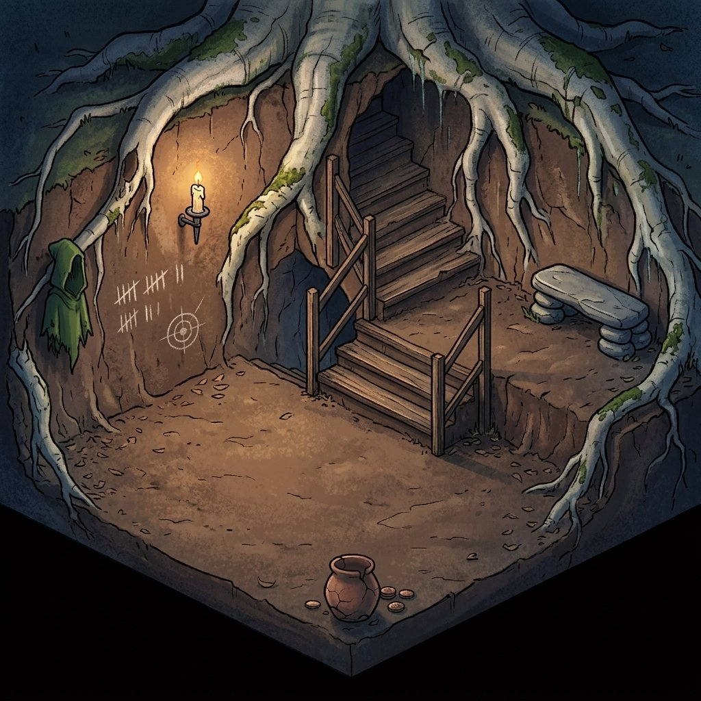
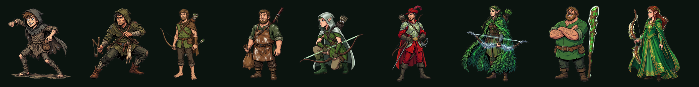
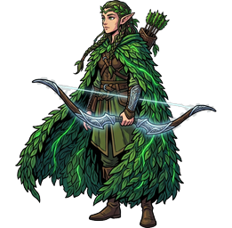

# 🏹 How HoodLoot Works

> **Rob the block. Share the wealth.**
> HoodLoot is an onchain idle‑mining game on **Robinhood Chain**. You recruit a band of outlaws — the Merry Men — deploy them in your hideout, and they loot **$SHARE** from every block. It's *Robin Hood, as a mining economy.*

---

## The one‑minute version

1. **Claim a hideout** (Forest Hollow — free to enter, a small ETH toll). Your **free starter outlaw** is minted to your wallet with it.
2. **Recruit outlaws** — spend $SHARE to *mint* a Merry Man into your wallet. 75% of the cost is **burned** ("given to the poor"), 25% goes to the **War Chest**.
3. **Deploy** outlaws onto tiles in your hideout — this *stakes* them, and only staked outlaws earn.
4. Your band's **Loot Rate** earns a share of every block's **$SHARE** emission, forever, ~10 blocks a second.
5. **Claim** your loot, **upgrade** your hideout for more room, and climb the **Legend** ranks for permanent multipliers.

---

## The core loop, step by step

### 1. Claim your hideout

Everyone starts at **Tier 1 — Forest Hollow**, a free hollow under the roots. Entering pays a small ETH toll (~$30, valued live via Chainlink) into the War Chest, and **mints your free Ragged Peasant** straight to your wallet.

Each hideout grants two limits:

| | Meaning |
|---|---|
| **Slots** | how many outlaws you can deploy at once |
| **Upkeep (U)** | the total upkeep budget your deployed outlaws may draw |

You climb through **9 hideouts**, each with more slots and a much larger upkeep budget.

### 2. Recruit (mint) ≠ Deploy (stake)

This is the heart of the game, and the two steps are deliberately separate:

- **RECRUIT** — spend $SHARE to **mint** an outlaw ERC‑1155 into *your wallet*. It's yours to keep, trade, or sell — but it **earns nothing** while it sits in your wallet. On recruit, **75% of the cost is burned** and **25% goes to the War Chest**.
- **DEPLOY** — **stake** an outlaw you own onto a hideout tile. Now it's *working* — it adds its **Loot Rate** and draws its **Upkeep**. Only **deployed** outlaws earn $SHARE.

You can also:

- **RECALL** — unstake a deployed outlaw back to your wallet. You keep it, its slot + upkeep free up, mining stops. Redeploy any time.
- **RELEASE** — burn a deployed outlaw for good to free its slot + upkeep. No $SHARE back — purely to make room.

### 3. Loot $SHARE from every block

Every Robinhood Chain block (~100 ms) emits a fixed amount of **$SHARE**, split across *all* players in proportion to their share of the global **Loot Rate**. Your outlaws take their cut of every block, block after block — you don't have to click. Rewards accrue in‑contract; you **claim** whenever you like.

### 4. Grow — upgrade & ascend

- **Upgrade** your hideout (Tiers 1→9) for more slots and upkeep, so you can field bigger, better outlaws.
- **Legend ranks** *(coming soon)* — a prestige system that will let you reset your run for a **permanent Loot Rate multiplier**. Full details at launch.

### 5. Share the wealth

The theme runs all the way through the economy: 75% of everything spent is **burned** — "given to the poor" — making $SHARE deflationary as the game grows.

---

## The Merry Men

Thirteen outlaws, from the Ragged Peasant to Robin Hood himself. Each has a **price** (in $SHARE), a **Loot Rate**, and an **Upkeep**. Higher outlaws are far more *loot‑efficient per upkeep* — which is what pulls you up the ladder.

| # | Outlaw | | Price ($SHARE) | Loot Rate | Upkeep |
|---|---|---|---|---|---|
| 1 | Ragged Peasant |  | Free | 100 | 1 |
| 2 | Village Poacher |  | 10 | 180 | 6 |
| 3 | Barefoot Archer |  | 20 | 420 | 8 |
| 4 | Much the Miller's Son |  | 32 | 1,000 | 10 |
| 5 | Elf Scout of Sherwood |  | 88 | 5,000 | 30 |
| 6 | Will Scarlet, Elf‑Trained |  | 196 | 15,000 | 50 |
| 7 | Elven Ranger |  | 330 | 20,000 | 90 |
| 8 | Little John, Oakheart |  | 772 | 60,000 | 200 |
| 9 | Maid Marian, Elf‑Blessed |  | 1,524 | 120,000 | 400 |
| 10–13 | Elf‑Knight · Golden Elf‑Archer · Elf‑Lord · **Robin Hood** | | *coming soon* | | |

> Deployed outlaws are held in the game's custody while they mine. A wallet‑held (undeployed) outlaw contributes **zero** Loot Rate — so trading undeployed outlaws never affects anyone's rewards.

---

## Emission — how $SHARE is minted

$SHARE has a **hard cap of 21,000,000**. **95%** is mined through play; **5% (1,050,000)** is minted once at genesis to seed a locked liquidity pool. No presale, no VC, no team salary reserve.

| Parameter | Value |
|---|---|
| Supply cap | **21,000,000 $SHARE** (immutable) |
| Player-mined | **19,950,000 (95%)** via block rewards |
| Genesis liquidity | **1,050,000 (5%)** one-time mint, LP locked |
| Emission | **~0.135031 $SHARE / block** (epoch 0) |
| Block time | ~0.1 s (Robinhood Chain) |
| Halving | every **77,760,000 blocks (~90 days)** — emission halves each epoch |
| Split on spend | **75% burned / 25% War Chest** |
| Referral | 2.5% of a claim to your referrer |

Rewards use a **MasterChef‑style accumulator**: one global "accumulated $SHARE per unit of Loot Rate" figure rolls forward every block, so every player's share is exact and O(1) to compute — no per‑player loops. The emission clock **starts lazily at the first outlaw ever deployed**, so no schedule is wasted before launch, and the token can never mint past 21M.

---

## Safety & trust

HoodLoot is built to be *credibly un‑ruggable*:

- **Supply, emission, and every price/stat are immutable** — hardcoded at deploy, no owner setter can change them.
- `$SHARE.mint` is hard‑capped at 21M — even a bug can't inflate past it.
- The only owner control is an **emergency Pause** (freeze recruiting/claims if an exploit appears). It **cannot** change numbers, mint, or move your funds — and **RECALL/RELEASE stay open even while paused**, so you can always pull your outlaws back to your wallet.
- Ownership is intended to sit behind a **multisig**.

See the [Disclaimer](reference/disclaimer.md) — HoodLoot is a game; $SHARE is an in‑game token with no promise of value.

---

## Where next

- [The Merry Men](game-assets-and-token/outlaws.md) — the full roster & lore
- [Hideouts](game-assets-and-token/hideouts.md) — all 9 tiers
- [$SHARE Token](game-assets-and-token/share-token.md) — tokenomics in depth
- [Virtual Mining](game-mechanics/virtual-mining.md) — the emission math
- [Legend Ranks](game-mechanics/legend-ranks.md) · [Referrals](game-mechanics/referrals.md)
